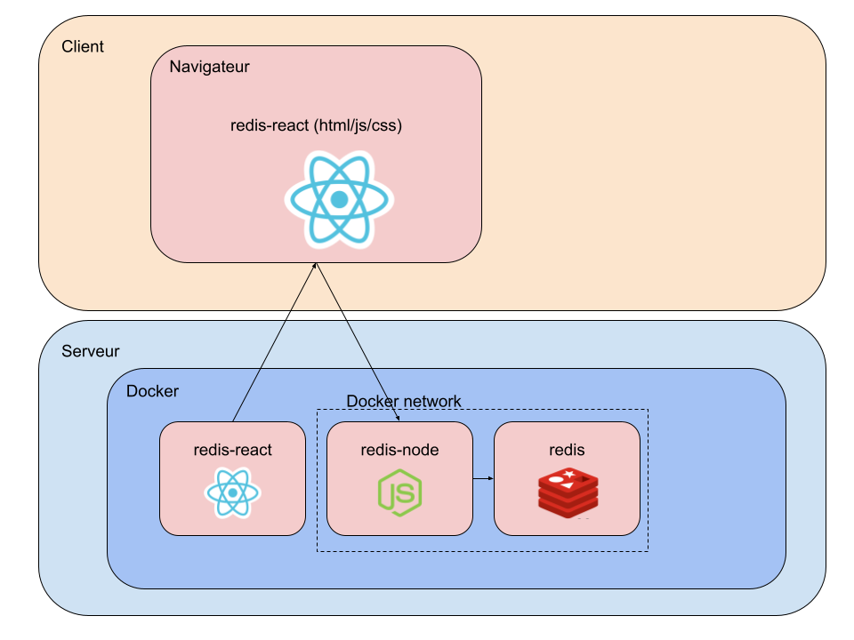

# TME 6

L'objectif de ce TME est de déployer une application de type web sur un cluster kubernetes.

## L'application

L'application est séparé en plusieurs parties :

- Un front end en react : <a href="https://github.com/arthurescriou/redis-react" >https://github.com/arthurescriou/redis-react</a>

- Un serveur en nodejs : <a href="https://github.com/arthurescriou/redis-node" >https://github.com/arthurescriou/redis-node</a>

- Une base de données redis : <a href="https://hub.docker.com/_/redis" >https://hub.docker.com/\_/redis</a>

## Kubernetes

Pour utiliser un cluster kubernetes il y a deux solutions principales :

- lancer un cluster minikube sur votre machine (impossible à la ppti)
- utiliser le cluster fourni (demandez les accès au chargé de TME)

## Objectifs

Créez une configuration à partir de fichier kubernetes en yaml.

Le but ici est de créer les objets kubernetes (déploiement, pods, services, etc...) permettant de faire fonctionner l'application.

Il est important de bien lire les `readme.md` des différentes parties du notre applications pour savoir comment les configurer correctement.

Il est également possible lancer l'application directement sur votre machine pour s'assurer du résultat attendu avant de commencer à travailler sur kubernetes.

## Etapes

### La base de données

Lancez une base de données redis à partir de l'image officielle fournis par redis.

Vérifiez son adresse et ses ports d'écoute.

### Le serveur

Créer un dockerfile et une image docker pour lancer le serveur nodejs. Configurez l'URL de connexion à la base redis convenablement.

Vérifiez son adresse et ses ports d'écoutes.

### Exposer le serveur à l'extérieur du cluster

Maintenant que le serveur fonctionne il faut pouvoir accéder à son API depuis un frontend : lui assigner une adresse accessible par internet.

Pour ça on veut utiliser un tunnel http : <a href="https://github.com/anderspitman/awesome-tunneling">https://github.com/anderspitman/awesome-tunneling</a>

Vous pouvez choisir le tunnel que vous préfèrez. Sinon il est conseillé d'utiliser localtunnel. <a href="https://github.com/localtunnel">https://github.com/localtunnel</a>

Récupérez l'adresse du tunnel.

### Le front end

Configurez le projet frontend avec l'adresse du tunnel.

Lancez la commande `build` du projet.
Créez une image hérbegeant les fichiers statiques built par la commande précédente.

Une fois ce conteneur déployé créez un autre tunnel dédié au frontend.

_NB: Pour ce genre de tâche il est possible également d'utiliser des services type CDN: netlify, aws cloudfront, render, etc_

# Documentation

- <a href="https://docs.docker.com/get-started/docker_cheatsheet.pdf">https://docs.docker.com/get-started/docker_cheatsheet.pdf</a>
- <a href="https://www.digitalocean.com/community/tutorials/how-to-build-a-node-js-appliction-with-docker#step-3-writing-the-dockerfile">https://www.digitalocean.com/community/tutorials/how-to-build-a-node-js-appliction-with-docker#step-3-writing-the-dockerfile</a>
- <a href="https://kubernetes.io/docs/reference/kubectl/quick-reference/">https://kubernetes.io/docs/reference/kubectl/quick-reference/</a> -<a href="https://www.scaleway.com/en/docs/containers/kubernetes/reference-content/kubernetes-cheatsheet/">https://www.scaleway.com/en/docs/containers/kubernetes/reference-content/kubernetes-cheatsheet/</a>
