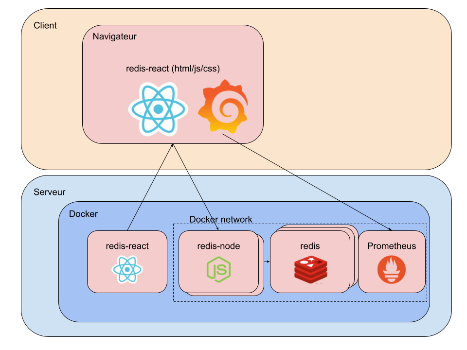

# Projet AutoScaling et IaC

L'objectif de ce projet est de créer une infrastructure pour le projet redis-nodejs vu en TME dans un cluster kubernetes.

Cette infrastructure devra pouvoir monter à l'échelle automatiquement pour chacun de ses composants.

De plus pour observer le comportement des différents composants il faudra configurer un outil de monitoring: prometheus/grafana.

## L'infrastructure

### Redis

Une base de données redis implémentant un pattern main/replicas.

Dans un premier temps seul les replicas pourront monter à l'échelle. Mais il est possible d'implémenter d'autres stratégies plus élaboré si le travail initial est terminé.

<a href="https://hub.docker.com/_/redis" >https://hub.docker.com/\_/redis</a>

### Nodejs

Un serveur nodejs stateless (vu en TME) qui appel la base redis et ses replicas.

<a href="https://github.com/arthurescriou/redis-node" >https://github.com/arthurescriou/redis-node</a>

### React

Un projet front end fait avec le framework React qui appel le serveur nodejs.
Qui doit être build pour être déployé par un serveur de fichier statique.

<a href="https://github.com/arthurescriou/redis-react" >https://github.com/arthurescriou/redis-react</a>

### Prometheus/grafana

Un outil de monitoring capable de se brancher sur plusieurs sources de données.

Il est indispensable de connecter prometheus au serveur nodejs via son api `/metrics`.

Cependant il est également possible d'ajouter des sources de données provenant de kubernetes ou redis grâce à des connecteurs supplémentaire.

<a href="https://hub.docker.com/r/prom/prometheus">https://hub.docker.com/r/prom/prometheus</a>

Prometheus vient avec le tableau de bord Grafana pour afficher les données :

<a href="https://hub.docker.com/r/grafana/grafana">https://hub.docker.com/r/grafana/grafana</a>

## Objectifs et rendu

L'objectif de ce projet est de créer l'infrastructure décrite ci-dessus, la déployer sur le cluster kubernetes fourni dans le cadre du cours et de documenter comment la reproduire.

Pour ça il faudra fournir un depôt git contenant les divers fichiers necessaire à sa création :

- configuration yaml de kubernetes et prometheus
- Dockerfile créés
- script bash d'automatisation
- un readme.md décrivant la démarche à suivre
- etc

Des images docker peuvent être aussi hebergé sur un depôt docker distant et fourni via la documentation.

De plus un rapport au format pdf décrivant plus en détails votre démarche et vos décisions lors de cette conception devra être ajouté au rendu.

Un soin particulier devra être apporté tout au long du projet et du rapport sur les notions de montée à l'échelle automatique et dynamique et sur la reproductibilitée du déploiement de l'infrastructure demandée.
